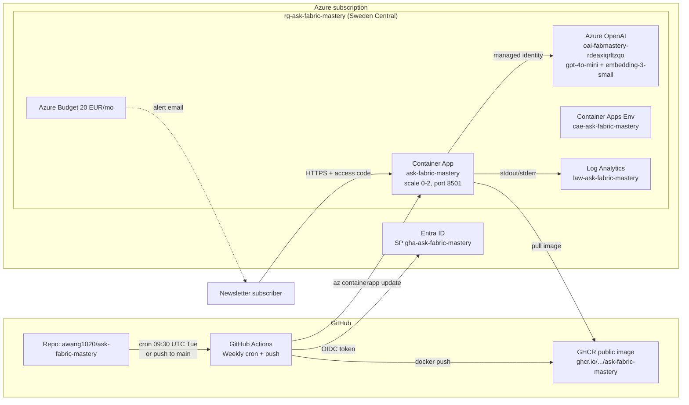

# Ask Fabric Mastery — RAG Chatbot

Production-ready Retrieval-Augmented Generation chatbot that answers
Microsoft Fabric and Power BI questions **strictly** from the
[Fabric Mastery newsletter](https://antoinewang.substack.com/) archive.
No hallucination, every answer cited with a direct link to the source
edition.

**Live app:** <https://ask-fabric-mastery.orangecoast-0153fc35.swedencentral.azurecontainerapps.io>
**Repo:** <https://github.com/awang1020/ask-fabric-mastery>

| Concern         | Choice |
| --------------- | ------ |
| LLM + embeddings | Azure OpenAI (`gpt-4o-mini` + `text-embedding-3-small`), Entra ID auth, no API keys |
| Orchestration   | LlamaIndex `ContextChatEngine` |
| Vector store    | ChromaDB persistent collection, baked into the image |
| UI              | Streamlit (Apple-style theme), EN/FR |
| Hosting         | Azure Container Apps, scale-to-zero, system-assigned managed identity |
| Container image | GitHub Container Registry (GHCR), built weekly by GitHub Actions |
| CI/CD           | GitHub Actions + OIDC federated identity (no long-lived secrets) |
| Cost ceiling    | Hard AOAI TPM cap (chat 10K, embed 30K) + Azure budget 20 €/mo with email alerts |
| Anti-bot        | Shared access code (env-var-controlled), per-session sliding rate limit |

---

## Table of contents

1. [Architecture](#1-architecture)
2. [Repository layout](#2-repository-layout)
3. [Local development](#3-local-development)
4. [One-time Azure setup](#4-one-time-azure-setup)
5. [One-time GitHub setup](#5-one-time-github-setup)
6. [Deploy infrastructure](#6-deploy-infrastructure)
7. [Set the access password](#7-set-the-access-password)
8. [Trigger the CI/CD pipeline](#8-trigger-the-cicd-pipeline)
9. [Operating in production](#9-operating-in-production)
10. [Security posture](#10-security-posture)
11. [Cost controls](#11-cost-controls)
12. [Troubleshooting](#12-troubleshooting)

---

## 1. Architecture



### Request flow

1. Visitor lands on the Container App URL → Streamlit shows the **access-code gate**.
2. Visitor enters the password → session marker stored in `st.session_state` (no cookie sent anywhere else).
3. Visitor types a question → in-app **rate limiter** checks the session has not exceeded `RATE_LIMIT_MAX_QUESTIONS` in `RATE_LIMIT_WINDOW_SECONDS`.
4. LlamaIndex retrieves the top-K chunks from the local Chroma collection (no network call).
5. Azure OpenAI embedding + chat are called over Entra ID (managed identity, no key).
6. Answer + source cards (title, date, score, snippet, direct Substack link) are rendered.

### Why this stack

- **No hallucination** — `ContextChatEngine` is wrapped by a strict system prompt that refuses to answer when retrieval is empty.
- **Self-contained image** — the Chroma index ships in the Docker image; pods start cold without any external storage.
- **Scale to zero** — no idle cost.
- **OIDC** — GitHub Actions never holds a long-lived Azure secret.
- **Hard cost ceiling** — capacity TPM limits + Azure budget make blowups financially impossible.

---

## 2. Repository layout

```
.
├── app.py                       # Streamlit UI (auth gate, rate limit, chat)
├── Dockerfile                   # Self-contained image (data + index baked in)
├── .dockerignore
├── .streamlit/config.toml       # Theme + telemetry off
├── .env.example                 # Local config template
├── requirements.txt
│
├── assets/                      # Static brand assets (logo, future favicons)
│   └── logo_substack.webp
│
├── src/
│   ├── config.py                # pydantic-settings (env-driven)
│   ├── models.py                # AzureOpenAI LLM + Embedding (Entra ID)
│   ├── indexer.py               # Loaders + Chroma collection
│   ├── chat_engine.py           # ContextChatEngine + enriched Source dataclass
│   ├── prompts.py               # Strict no-hallucination system prompt
│   ├── retriever.py             # Wrapper around VectorIndexRetriever
│   ├── safety.py                # Password gate + per-session rate limit
│   └── i18n.py                  # EN/FR translations
│
├── scripts/
│   ├── ingest_substack.py       # Substack archive → Markdown (browser UA + 403 fallback)
│   ├── build_index.py           # Chroma index builder
│   ├── deploy_azure.ps1         # One-shot RG + AOAI deploy
│   └── setup_github_oidc.ps1    # Bootstrap SP + federated cred + RBAC
│
├── infra/
│   ├── main.bicep               # Subscription-scope: RG + AOAI module
│   ├── main.bicepparam
│   ├── openai.bicep             # AOAI account + 2 deployments
│   ├── app.bicep                # LAW + ACA Env + Container App + RBAC
│   └── budget.json              # 20 EUR/mo with email alerts
│
├── .github/workflows/refresh.yml  # Weekly ingest -> embed -> build -> push -> deploy
│
├── data/newsletters/            # 23 markdowns + _sources_index.json (committed)
└── storage/chroma/              # 86-chunk Chroma collection (NOT committed)
```

---

## 3. Local development

### Prerequisites

| Tool       | Version | Install hint |
| ---------- | ------- | ------------ |
| Python     | 3.11+   | <https://www.python.org/> |
| Azure CLI  | 2.60+   | `winget install Microsoft.AzureCLI` |
| GitHub CLI | 2.40+   | `winget install GitHub.cli` |
| PowerShell | 7+      | `winget install Microsoft.PowerShell` |
| Docker     | optional | only needed to build/test the image locally |

### Setup

```powershell
git clone https://github.com/awang1020/ask-fabric-mastery.git
cd ask-fabric-mastery

python -m venv .venv
. .venv\Scripts\Activate.ps1
pip install -r requirements.txt

az login
az account set --subscription <YOUR_SUB_ID>

Copy-Item .env.example .env
# Edit .env — at minimum:
#   AZURE_OPENAI_ENDPOINT=...
#   AZURE_OPENAI_CHAT_DEPLOYMENT=gpt-4o-mini
#   AZURE_OPENAI_EMBEDDING_DEPLOYMENT=text-embedding-3-small

# Optional: cache new posts from the newsletter (the repo already ships 23 of them)
python -m scripts.ingest_substack --skip-paywalled --delay 0.4

# Build the Chroma index (one-shot; ~30 sec for 23 posts)
python -m scripts.build_index --rebuild

# Run the UI
streamlit run app.py
```

The first AOAI call will use your `az login` identity, so make sure you have
the **Cognitive Services OpenAI User** role on the AOAI account.

### Local auth + rate-limit testing

```powershell
$env:APP_PASSWORD = "test1234"
$env:RATE_LIMIT_MAX_QUESTIONS = "3"
$env:RATE_LIMIT_WINDOW_SECONDS = "60"
streamlit run app.py
```

---

## 4. One-time Azure setup

The AOAI account + 2 deployments are provisioned by `infra/main.bicep`.

```powershell
# Register required providers (idempotent)
az provider register -n Microsoft.App --wait
az provider register -n Microsoft.OperationalInsights --wait
az provider register -n Microsoft.CognitiveServices --wait

# Subscription-scope deploy: creates rg + AOAI + deployments
az deployment sub create `
  --location swedencentral `
  --template-file infra/main.bicep `
  --parameters infra/main.bicepparam
```

Outputs include the AOAI account name (`oai-fabmastery-rdeaxiqrltzqo` in this
repo). All later commands reference that name.

> **Region note.** Sweden Central was picked because `text-embedding-3-small`
> requires `GlobalStandard` SKU there. If you change regions, double-check
> the SKU availability table.

> **Tenant note.** The tenant used here enforces `disableLocalAuth=true`,
> so no API key is ever issued. All code paths use Entra ID via
> `ChainedTokenCredential(AzureCliCredential, EnvironmentCredential,
> ManagedIdentityCredential)`.

---

## 5. One-time GitHub setup

### a) Create the repo

```powershell
gh repo create <OWNER>/<REPO> --public --source . --remote origin --push
```

### b) Bootstrap OIDC (least-privilege SP + federated trust)

```powershell
pwsh ./scripts/setup_github_oidc.ps1 `
  -GithubOwner <OWNER> `
  -GithubRepo  <REPO> `
  -OpenAiName  oai-fabmastery-rdeaxiqrltzqo
```

This script:
- Creates an Entra ID app registration + service principal (idempotent).
- Adds **one** federated credential bound to `refs/heads/main`
  (we intentionally do **not** create a `pull_request` one because on a
  public repo it would let any fork PR mint a token).
- Grants the SP **Cognitive Services OpenAI User** on the AOAI account.
- Prints all secrets/variables to set on the repo.

### c) Tighten the SP scope (after the first deploy)

Once the Container App exists, downgrade the SP from Contributor to the
least-privilege role that can update images:

```powershell
$spId = az ad sp list --filter "appId eq '<CLIENT_ID>'" --query "[0].id" -o tsv
$rg   = "/subscriptions/<SUB>/resourceGroups/rg-ask-fabric-mastery"
$app  = "$rg/providers/Microsoft.App/containerapps/ask-fabric-mastery"

az role assignment delete --assignee-object-id $spId --role "Contributor" --scope $rg
az role assignment create --assignee-object-id $spId --assignee-principal-type ServicePrincipal `
  --role "358470bc-b998-42bd-ab17-a7e34c199c0f" --scope $app   # Container Apps Contributor
```

### d) Set the workflow secrets + variables

```powershell
gh secret set AZURE_CLIENT_ID       --body "<from-script-output>"
gh secret set AZURE_TENANT_ID       --body "<from-script-output>"
gh secret set AZURE_SUBSCRIPTION_ID --body "<from-script-output>"

gh variable set AZURE_RESOURCE_GROUP              --body "rg-ask-fabric-mastery"
gh variable set AZURE_CONTAINERAPP_NAME           --body "ask-fabric-mastery"
gh variable set AZURE_OPENAI_ENDPOINT             --body "https://oai-fabmastery-rdeaxiqrltzqo.openai.azure.com/"
gh variable set AZURE_OPENAI_CHAT_DEPLOYMENT      --body "gpt-4o-mini"
gh variable set AZURE_OPENAI_CHAT_MODEL           --body "gpt-4o-mini"
gh variable set AZURE_OPENAI_EMBEDDING_DEPLOYMENT --body "text-embedding-3-small"
gh variable set AZURE_OPENAI_EMBEDDING_MODEL      --body "text-embedding-3-small"
```

---

## 6. Deploy infrastructure

The Container App + Log Analytics + Env + role assignment all live in `infra/app.bicep`.

```powershell
az deployment group create `
  --resource-group rg-ask-fabric-mastery `
  --template-file infra/app.bicep `
  --parameters openAiName=oai-fabmastery-rdeaxiqrltzqo `
  --query "{appUrl: properties.outputs.appUrl.value}" -o json
```

The first deploy uses a placeholder image (`mcr.microsoft.com/k8se/quickstart`)
on purpose; the GHA workflow replaces it with the real GHCR image on the
first run.

### Apply the cost guardrail

```powershell
# 1) Cap absolute AOAI throughput
az cognitiveservices account deployment create `
  -g rg-ask-fabric-mastery -n oai-fabmastery-rdeaxiqrltzqo `
  --deployment-name gpt-4o-mini --model-name gpt-4o-mini `
  --model-version "2024-07-18" --model-format OpenAI `
  --sku-name GlobalStandard --sku-capacity 10        # 10K TPM

az cognitiveservices account deployment create `
  -g rg-ask-fabric-mastery -n oai-fabmastery-rdeaxiqrltzqo `
  --deployment-name text-embedding-3-small --model-name text-embedding-3-small `
  --model-version "1" --model-format OpenAI `
  --sku-name GlobalStandard --sku-capacity 30        # 30K TPM

# 2) Subscription-level monthly budget on this RG
az rest --method PUT `
  --url "https://management.azure.com/subscriptions/<SUB>/providers/Microsoft.Consumption/budgets/budget-ask-fabric-mastery?api-version=2024-08-01" `
  --body "@infra/budget.json"
```

`infra/budget.json` triggers email alerts at 50%, 80% (actual) and 100%
(forecast).

---

## 7. Set the access password

The image looks at the env var `APP_PASSWORD` at request time. Set it as a
Container Apps **secret** so it never appears in plain text in any template
or log:

```powershell
$pwd = -join ((48..57) + (65..90) + (97..122) | Get-Random -Count 24 | ForEach-Object {[char]$_})
Write-Host "Generated password (save it now): $pwd"

az containerapp secret set -g rg-ask-fabric-mastery -n ask-fabric-mastery `
  --secrets "app-password=$pwd"

az containerapp update -g rg-ask-fabric-mastery -n ask-fabric-mastery `
  --set-env-vars `
    "APP_PASSWORD=secretref:app-password" `
    "RATE_LIMIT_MAX_QUESTIONS=20" `
    "RATE_LIMIT_WINDOW_SECONDS=900"
```

Share that password to your audience via the newsletter. Anyone without it
just sees the unlock screen — no AOAI call is made, no token is spent.

To rotate it later, repeat the two commands. Any open session is
invalidated as soon as Streamlit reruns.

---

## 8. Trigger the CI/CD pipeline

```powershell
gh workflow run refresh.yml --repo <OWNER>/<REPO>
```

The workflow:

1. Checks out the repo (which ships the 23 markdown sources + index source files).
2. Runs `scripts.ingest_substack` — if Substack returns 403 to the GitHub
   runner (it does as of writing), the script logs a warning and falls
   back to the committed cache.
3. Runs `scripts.build_index --rebuild` — re-embeds via AOAI under the
   workflow's Entra identity (OIDC).
4. `docker buildx build` → push to GHCR with `:latest` and `:YYYYMMDD-HHMMSS` tags.
5. `az containerapp update` to roll a new revision pointing at the new tag.

A weekly cron at **Tuesday 09:30 UTC** runs the same pipeline so the index
stays current without you doing anything.

---

## 9. Operating in production

### Get the public URL

```powershell
az containerapp show -g rg-ask-fabric-mastery -n ask-fabric-mastery `
  --query properties.configuration.ingress.fqdn -o tsv
```

### Tail container logs

```powershell
az containerapp logs show -g rg-ask-fabric-mastery -n ask-fabric-mastery --tail 100 --follow
```

### Roll back to a previous revision

```powershell
az containerapp revision list -g rg-ask-fabric-mastery -n ask-fabric-mastery -o table
az containerapp revision activate -g rg-ask-fabric-mastery -n ask-fabric-mastery `
  --revision <revision-name>
```

### Force scale-up (kill cold starts while traffic is expected)

```powershell
az containerapp update -g rg-ask-fabric-mastery -n ask-fabric-mastery `
  --min-replicas 1 --max-replicas 3
```

### Rotate the password

```powershell
$pwd = -join ((48..57) + (65..90) + (97..122) | Get-Random -Count 24 | ForEach-Object {[char]$_})
az containerapp secret set -g rg-ask-fabric-mastery -n ask-fabric-mastery `
  --secrets "app-password=$pwd"
az containerapp update -g rg-ask-fabric-mastery -n ask-fabric-mastery # restart picks new secret
```

---

## 10. Security posture

| Layer | Control | Status |
| ----- | ------- | ------ |
| Network | HTTPS only (`allowInsecure: false`), TLS managed by ACA | ✅ |
| Network | Public ingress on port 8501 | ⚠ public by design (newsletter audience) |
| Auth (data plane) | AOAI `disableLocalAuth=true` → no API key exists | ✅ |
| Auth (data plane) | Container App talks to AOAI via system-assigned managed identity | ✅ |
| Auth (UI) | Shared access code stored as ACA secret, gates every render | ✅ |
| Auth (UI) | Per-session sliding-window rate limit (20 questions / 15 min) | ✅ |
| Auth (CI/CD) | GitHub OIDC federated to `refs/heads/main` only (no PR cred) | ✅ |
| RBAC | SP scoped to `Container Apps Contributor` on the app + `Cognitive Services OpenAI User` on AOAI | ✅ |
| Secrets | `.env`, `storage/`, `.vscode/` excluded by `.gitignore` | ✅ |
| Secrets | No long-lived secret on any side (OIDC + managed identity) | ✅ |
| Cost | AOAI capacity capped at 10K TPM chat + 30K TPM embedding | ✅ |
| Cost | Azure Budget 20 €/mo with 3 email alerts | ✅ |
| Image | Self-contained, no runtime download of code or data | ✅ |
| Image | Currently runs as `root` (low risk on a minimal Debian slim) | ⚠ accept |
| Reliability | Single region, single zone (`zoneRedundant: false`) | ⚠ accept |
| Reliability | Liveness + readiness probes on `/_stcore/health` | ✅ |
| Observability | Container logs + console go to Log Analytics | ✅ |
| Observability | No APM / tracing yet (Application Insights not wired) | ⚠ backlog |

### What we explicitly DID NOT enable (and why)

- **Container Apps built-in Entra ID auth.** Would force every visitor into
  your tenant; we want newsletter readers (external users) to access the
  app via a shared code instead.
- **Azure Front Door + WAF.** Adds ~30 €/mo for marginal benefit at this
  scale. The TPM cap + budget already bound the worst-case bill.

---

## 11. Cost controls

### Steady-state monthly bill (low traffic, scale-to-zero)

| Item | Estimate |
| ---- | -------- |
| Container Apps (idle most of the time) | ~0–3 € |
| Log Analytics (1 GB/day cap) | ~2–3 € |
| Azure OpenAI tokens (~1 question per visitor, ~2K tokens) | ~0.5–5 € |
| GHCR storage + bandwidth | 0 € (free for public packages) |
| GitHub Actions minutes (~13 min/run × 4 runs/mo) | 0 € (within free tier) |
| **Total** | **~5–12 €/mo** |

### Hard ceiling (worst-case if someone hammers the password)

- AOAI capacity caps inference rate at ~10K TPM chat → ~30 questions/min
  at 1K-token answers.
- Per-session rate limit caps a *single* visitor at 20 questions / 15 min.
- The Azure budget alerts you at 10/16/20 € absolute.
- If a malicious actor distributes the password, the worst-case sustained
  cost is around 5–10 €/hour for as long as the password stays leaked.
  Rotating the password (Step 9) takes ~30 seconds and immediately stops
  the bleeding.

---

## 12. Troubleshooting

| Symptom | Diagnosis | Fix |
| ------- | --------- | --- |
| `403 Forbidden` on Substack from GitHub runner | Substack rate-limits cloud egress IPs | Workflow already falls back to the committed Markdown cache. Re-ingest locally and push to refresh. |
| `cannot import name 'refresh_sources_index'` in Streamlit | Stale `__pycache__` after a `src/` edit | `Get-ChildItem -Recurse -Directory __pycache__ \| Remove-Item -Recurse -Force` then restart Streamlit. |
| `DefaultAzureCredential` picks Azure Arc and fails | Local dev machine has Azure Arc enrolled | The code uses `ChainedTokenCredential(AzureCli, Env, ManagedIdentity)` — make sure you ran `az login`. |
| `text-embedding-3-small Standard not supported` during deploy | Region/SKU mismatch | Use `GlobalStandard` in Sweden Central (already in the Bicep). |
| Container App returns 502 after a deploy | Image still pulling, or readiness probe failing | `az containerapp revision show ... --query properties.healthState`, then check logs. |
| `gh workflow run` says "the workflow file is invalid" | YAML indentation broken by an editor | Run `gh workflow view refresh.yml` for the parser's exact line/column. |
| App password change not taken into account | Container App not restarted after secret update | `az containerapp update ... --set-env-vars ...` (an env-var rewrite triggers a restart). |

### Useful one-liners

```powershell
# Workflow status of the latest 5 runs
gh run list --repo <OWNER>/<REPO> --limit 5

# Show the failing step's log
gh run view <RUN_ID> --repo <OWNER>/<REPO> --log-failed | Select-String -Pattern "error|Traceback"

# What rights does the GHA SP actually have?
$spId = az ad sp list --filter "appId eq '<CLIENT_ID>'" --query "[0].id" -o tsv
az role assignment list --assignee $spId --all -o table

# Force re-pull a specific image tag
az containerapp update -g rg-ask-fabric-mastery -n ask-fabric-mastery `
  --image ghcr.io/<OWNER>/<REPO>/ask-fabric-mastery:<TAG>
```

---

## License

MIT. Newsletter content remains © [Antoine Wang](https://antoinewang.substack.com/).
