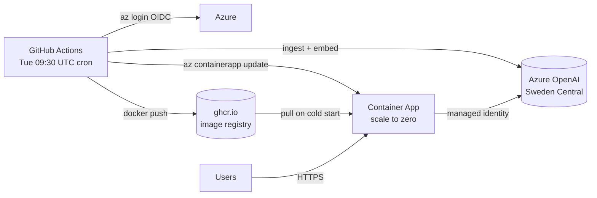

# Ask Fabric Mastery — RAG Chatbot

Production-ready Retrieval-Augmented Generation chatbot that answers Microsoft
Fabric and Power BI questions **strictly** from the **Fabric Mastery newsletter
archive** — no hallucination, every answer cited.

| Concern         | Choice                                        |
| --------------- | --------------------------------------------- |
| LLM + embeddings | Azure OpenAI (Entra ID, no API keys)         |
| Orchestration    | LlamaIndex                                    |
| Vector store     | ChromaDB (persistent, baked into the image)   |
| UI               | Streamlit, refreshed design                   |
| Hosting          | Azure Container Apps (scale-to-zero) + GHCR   |
| Refresh schedule | GitHub Actions cron, Tuesdays 09:30 UTC       |
| Languages        | French / English                              |
| Python           | 3.11+                                         |

---

## Two ways to run

1. **Local** — develop and chat from your workstation.
2. **Production** — GitHub Actions weekly rebuilds & ships a new container revision to Azure Container Apps (the chatbot is reachable at a public HTTPS URL and costs ~5–12 €/month at low traffic).

Both share the same Azure OpenAI account, ingest, indexer, and chat engine.

---

## 1. Prerequisites

- **Python 3.11+**
- **PowerShell 7+** and **Azure CLI 2.60+** (for the one-shot Azure deployment).
- An Azure subscription with permission to create resource groups and Cognitive
  Services (Azure OpenAI) accounts.

## 2. Install

```powershell
python -m venv .venv
.venv\Scripts\Activate.ps1
pip install -r requirements.txt
```

On macOS / Linux:

```bash
python3 -m venv .venv
source .venv/bin/activate
pip install -r requirements.txt
```

## 3. Provision Azure OpenAI (one command)

The Bicep template in [infra/](infra/) creates a resource group, an Azure
OpenAI account, a chat deployment (`gpt-4o-mini`) and an embedding deployment
(`text-embedding-3-small`). The PowerShell wrapper then writes a working `.env`
straight to the repo root.

```powershell
az login                                  # if not already logged in
pwsh ./scripts/deploy_azure.ps1 -Location eastus2
```

Useful flags:

```powershell
pwsh ./scripts/deploy_azure.ps1 -WhatIf                                  # preview only
pwsh ./scripts/deploy_azure.ps1 -ResourceGroupName rg-fabric -Location swedencentral
pwsh ./scripts/deploy_azure.ps1 -SubscriptionId <guid>
```

> Don't want to deploy? Copy `.env.example` to `.env` and fill in an existing
> Azure OpenAI endpoint, key, and deployment names by hand.

## 4. Ingest the Fabric Mastery newsletter

```powershell
python -m scripts.ingest_substack                              # default: antoinewang.substack.com
python -m scripts.ingest_substack --url https://other.substack.com --limit 25
python -m scripts.ingest_substack --force                      # re-download everything
```

Each post is saved under [data/newsletters/](data/newsletters/) as
`<date>_<slug>.md` with YAML front-matter so LlamaIndex picks up the title,
URL, and date as searchable metadata. The folder also accepts your own
`.pdf`, `.md`, `.txt`, and `.docx` files.

## 5. Build the index

Either from the command line:

```powershell
python -m scripts.build_index           # incremental
python -m scripts.build_index --rebuild # full rebuild
```

…or from the UI sidebar (**Build index** button).

The vector store is persisted under [storage/chroma/](storage/chroma/) and is
reused across runs.

## 6. Run the app

```powershell
streamlit run app.py
```

Open <http://localhost:8501>, pick a language in the sidebar, ask a question.

---

## Project layout

```
.
├── app.py                       # Streamlit UI (refreshed)
├── Dockerfile                   # Self-contained image (app + data + index)
├── .dockerignore
├── .streamlit/config.toml       # Theme tokens
├── .github/workflows/refresh.yml # Weekly ingest → embed → image → deploy
├── scripts/
│   ├── build_index.py           # CLI: build / rebuild the index
│   ├── ingest_substack.py       # CLI: pull posts from a Substack archive
│   ├── deploy_azure.ps1         # Deploy Azure OpenAI + write .env
│   └── setup_github_oidc.ps1    # Federated identity + RBAC for GH Actions
├── infra/
│   ├── main.bicep               # Sub-scope: RG + Azure OpenAI
│   ├── openai.bicep             # AOAI account + chat & embedding deployments
│   ├── app.bicep                # RG-scope: Container Apps + LAW + RBAC
│   └── main.bicepparam          # Default parameters
├── src/
│   ├── config.py                # Centralized env-driven settings
│   ├── models.py                # Azure OpenAI LLM + embedding factories
│   ├── prompts.py               # Strict-grounding system prompts (EN/FR)
│   ├── indexer.py               # Document loading + ChromaDB indexing
│   ├── retriever.py             # Vector retriever + similarity cutoff
│   ├── chat_engine.py           # Grounded ContextChatEngine + enriched sources
│   └── i18n.py                  # UI translations (EN/FR)
├── data/newsletters/            # Source documents + _sources_index.json
├── storage/chroma/              # Persistent vector store
├── .env.example                 # Configuration template
└── requirements.txt
```

---

## Production deployment (GitHub + Azure Container Apps)

For a public/team-facing chatbot that auto-refreshes after every newsletter
publication. Estimated cost: **~5–12 €/month** at low traffic (scale-to-zero
between visits, GHCR free, GitHub Actions ~13 min/month).

### Architecture



Key design choices:
- **Image is self-contained.** Each refresh rebuilds `data/` + `storage/chroma/` inside the image, so the running container has no external storage dependency. No Azure File share, no Blob mount, no cold-start ETL.
- **No secrets anywhere.** GitHub Actions auth via OIDC → Entra ID app. Container App auth to Azure OpenAI via system-assigned managed identity. Your AOAI account stays `disableLocalAuth=true`.
- **Scale-to-zero.** `minReplicas: 0` — the app costs ~0 € when nobody visits. First request takes ~5–10 s to warm up.
- **LAW capped at 1 GB/day** so logs cannot blow up your bill.

### One-time setup

Prerequisites: the Azure stack from `scripts/deploy_azure.ps1` is already
deployed (you have the `oai-fabmastery-*` account and `rg-ask-fabric-mastery`).

```powershell
# 1. Push the repo to GitHub.
#    Whatever owner/repo you use, remember them — they'll be passed to the script.

# 2. Federate GitHub Actions with Azure + grant the right RBAC roles.
pwsh ./scripts/setup_github_oidc.ps1 `
    -GithubOwner antoinewang `
    -GithubRepo  ask-fabric-mastery `
    -OpenAiName  oai-fabmastery-rdeaxiqrltzqo

# 3. Copy the printed secrets/variables into your GitHub repo:
#       Settings → Secrets and variables → Actions
#    (or paste the gh CLI commands the script prints).

# 4. Deploy the Container Apps environment + Container App (hello-world placeholder).
az deployment group create `
    --resource-group rg-ask-fabric-mastery `
    --template-file infra/app.bicep `
    --parameters openAiName=oai-fabmastery-rdeaxiqrltzqo

# 5. Trigger the first GitHub Actions run (workflow_dispatch).
#    It'll ingest, embed, build the real image, push to ghcr.io, and update the
#    Container App. After ~5 min, the app is live.

# 6. Get the public URL.
az containerapp show -g rg-ask-fabric-mastery -n ask-fabric-mastery `
    --query properties.configuration.ingress.fqdn -o tsv
```

### Ongoing operations

Nothing to do. Every Tuesday at 09:30 UTC the workflow:

1. Pulls new Substack posts (idempotent).
2. Re-embeds the incremental chunks via Azure OpenAI.
3. Builds a new Docker image tagged `YYYYMMDD-HHMMSS` + `latest`.
4. Pushes to `ghcr.io/<owner>/<repo>/ask-fabric-mastery`.
5. Rolls a new Container App revision (zero downtime).

Force a refresh after an off-cycle post:

```bash
gh workflow run refresh.yml
```

Tear it all down:

```powershell
az group delete --name rg-ask-fabric-mastery --yes --no-wait
```

---

## Local development

## 1. Prerequisites

- **Python 3.11+**
- **PowerShell 7+** and **Azure CLI 2.60+** (for the one-shot Azure deployment).
- An Azure subscription with permission to create resource groups and Cognitive
  Services (Azure OpenAI) accounts.

## 2. Install

```powershell
python -m venv .venv
.venv\Scripts\Activate.ps1
pip install -r requirements.txt
```

On macOS / Linux:

```bash
python3 -m venv .venv
source .venv/bin/activate
pip install -r requirements.txt
```

## 3. Provision Azure OpenAI (one command)

The Bicep template in [infra/](infra/) creates a resource group, an Azure
OpenAI account, a chat deployment (`gpt-4o-mini`) and an embedding deployment
(`text-embedding-3-small`). The PowerShell wrapper then writes a working `.env`
straight to the repo root.

```powershell
az login                                  # if not already logged in
pwsh ./scripts/deploy_azure.ps1 -Location swedencentral
```

Useful flags:

```powershell
pwsh ./scripts/deploy_azure.ps1 -WhatIf                                  # preview only
pwsh ./scripts/deploy_azure.ps1 -ResourceGroupName rg-fabric -Location swedencentral
pwsh ./scripts/deploy_azure.ps1 -SubscriptionId <guid>
```

> Don't want to deploy? Copy `.env.example` to `.env` and fill in an existing
> Azure OpenAI endpoint, key, and deployment names by hand.

## 4. Ingest the Fabric Mastery newsletter

```powershell
python -m scripts.ingest_substack                              # default: antoinewang.substack.com
python -m scripts.ingest_substack --url https://other.substack.com --limit 25
python -m scripts.ingest_substack --force                      # re-download everything
```

Each post is saved under [data/newsletters/](data/newsletters/) as
`<date>_<slug>.md` with YAML front-matter so LlamaIndex picks up the title,
URL, and date as searchable metadata. The folder also accepts your own
`.pdf`, `.md`, `.txt`, and `.docx` files. A `_sources_index.json` is written
alongside so the chat UI can show real post titles and direct links.

## 5. Build the index

Either from the command line:

```powershell
python -m scripts.build_index           # incremental
python -m scripts.build_index --rebuild # full rebuild
```

…or from the UI sidebar (**Build index** button).

The vector store is persisted under [storage/chroma/](storage/chroma/) and is
reused across runs.

## 6. Run the app

```powershell
streamlit run app.py
```

Open <http://localhost:8501>, pick a language in the sidebar, ask a question.

## RAG safety rules (enforced)

1. The chatbot answers **only** from retrieved context — see the system prompts
   in [src/prompts.py](src/prompts.py).
2. A `SimilarityPostprocessor` (`SIMILARITY_CUTOFF`) drops low-confidence
   chunks before they reach the LLM.
3. Every answer ships with explicit **source citations** (file, page, score,
   snippet) shown in the UI.
4. When the context is insufficient the bot explicitly says it cannot answer
   instead of guessing.

## Configuration reference

All knobs live in `.env` — see [.env.example](.env.example):

| Variable                              | Default                  | Purpose                                  |
| ------------------------------------- | ------------------------ | ---------------------------------------- |
| `AZURE_OPENAI_ENDPOINT`               | —                        | Your Azure OpenAI endpoint URL.          |
| `AZURE_OPENAI_API_KEY`                | —                        | Azure OpenAI key.                        |
| `AZURE_OPENAI_API_VERSION`            | `2024-10-21`             | REST API version.                        |
| `AZURE_OPENAI_CHAT_DEPLOYMENT`        | `gpt-4o`                 | Chat deployment name.                    |
| `AZURE_OPENAI_CHAT_MODEL`             | `gpt-4o`                 | Underlying chat model id (for tokenizer).|
| `AZURE_OPENAI_EMBEDDING_DEPLOYMENT`   | `text-embedding-3-large` | Embedding deployment name.               |
| `AZURE_OPENAI_EMBEDDING_MODEL`        | `text-embedding-3-large` | Underlying embedding model id.           |
| `DATA_DIR`                            | `./data/newsletters`     | Source documents folder.                 |
| `STORAGE_DIR`                         | `./storage/chroma`       | ChromaDB persistent path.                |
| `COLLECTION_NAME`                     | `fabric_mastery`         | ChromaDB collection name.                |
| `CHUNK_SIZE`                          | `1024`                   | Splitter chunk size (tokens).            |
| `CHUNK_OVERLAP`                       | `128`                    | Splitter overlap (tokens).               |
| `TOP_K`                               | `6`                      | Retriever top-k.                         |
| `SIMILARITY_CUTOFF`                   | `0.35`                   | Min cosine similarity to keep a chunk.   |
| `TEMPERATURE`                         | `0.1`                    | Chat temperature.                        |
| `MAX_TOKENS`                          | `1024`                   | Chat max output tokens.                  |
| `DEFAULT_LANGUAGE`                    | `en`                     | Initial UI language (`en` or `fr`).      |

## Troubleshooting

- **`Configuration error`** at startup → your `.env` is missing required values
  (endpoint / key / deployments). Compare with `.env.example`.
- **`No index found`** in the UI → drop files into `data/newsletters/` and
  click **Build index** in the sidebar.
- **Empty answers / "I cannot answer…"** → either the archive does not cover
  the topic, or your `SIMILARITY_CUTOFF` is too aggressive. Try `0.2`.
- **Azure 401/403** → wrong key, wrong endpoint, or your deployment names do
  not match what is configured in Azure OpenAI.
